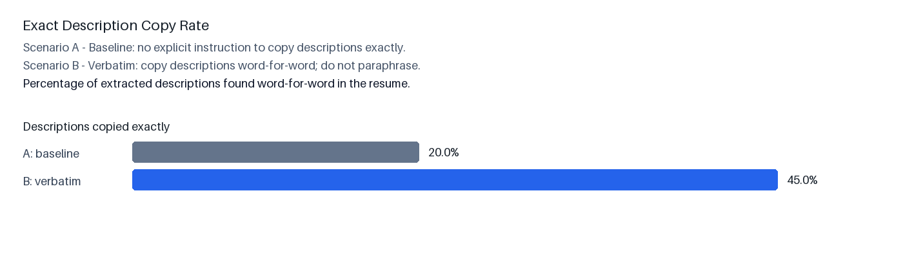
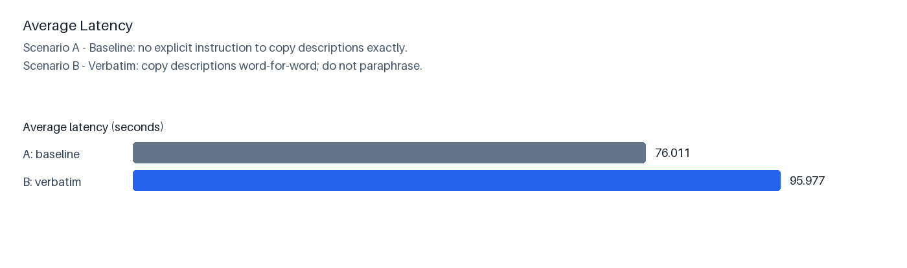
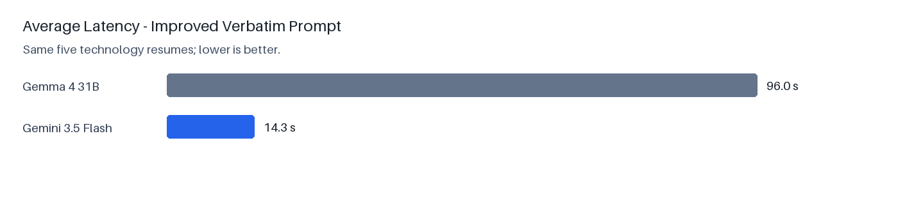
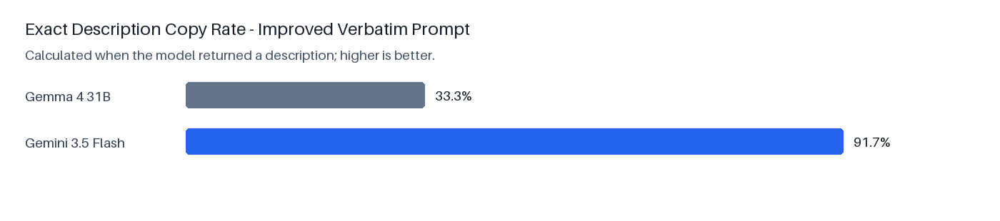

# Prompt and Model Experimentation Summary

## 1. Prompt experimentation

The initial extraction prompt did not explicitly require descriptions to be
copied from the resume. Consequently, the model sometimes paraphrased the
experience and project descriptions.

The following rule was added to the improved prompt:

> Copy experience and project descriptions word-for-word as written. Do not
> summarise, rewrite, improve, or paraphrase them.

Both prompts were tested using the same five technology resumes and the same
Gemma 4 31B model.

| Prompt | Exact description copy rate |
|---|---:|
| Scenario A: original prompt | 20% |
| Scenario B: improved verbatim prompt | 45% |

The exact copy rate increased by 25 percentage points after adding the explicit
instruction. This showed that prompt wording materially affected extraction
behaviour.



The improved prompt had higher average latency in this small experiment:

| Prompt | Average latency |
|---|---:|
| Scenario A: original prompt | 76.0 seconds |
| Scenario B: improved verbatim prompt | 96.0 seconds |



## 2. Model comparison using the improved prompt

The improved verbatim prompt was then kept fixed while the model was changed
from Gemma 4 31B to Gemini 3.5 Flash. Both models processed the same five
technology resumes.

| Model | Successful runs | Average latency | Exact copy rate* |
|---|---:|---:|---:|
| Gemma 4 31B | 5/5 | 96.0 seconds | 33.3% |
| Gemini 3.5 Flash | 5/5 | 14.3 seconds | 91.7% |

\*For this direct model comparison, exact copy rate is calculated over resumes
where the model returned at least one description.

Gemini 3.5 Flash was approximately 6.7 times faster and produced substantially
more descriptions that matched the resume word-for-word. Based on these
results, Gemini 3.5 Flash is the stronger model for the implemented resume
description-extraction configuration.





## 3. Example implementation output

A complete extracted JSON example is available here:

[Redacted sample extracted resume JSON](gemini35_verbatim/sample_extracted_resume.json)

Direct identifiers and identifying dates were redacted for report use. The
structure and extracted non-identifying fields are unchanged.

## Reproducing the Gemini experiment

Run from the `backend` directory:

```bash
.venv/bin/python -u experiments/run_description_ab.py \
  --model gemini-3.5-flash \
  --versions v002 \
  --experiment gemini35_verbatim_raw \
  --results gemini35_verbatim.jsonl

.venv/bin/python experiments/analyze_model_comparison.py
```
