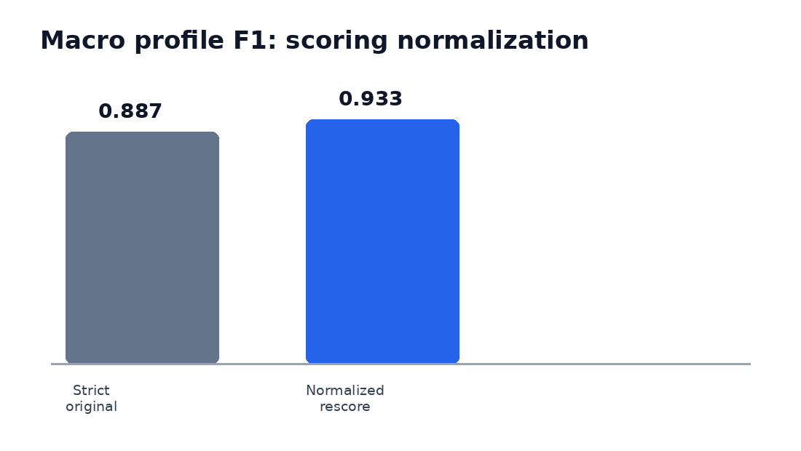
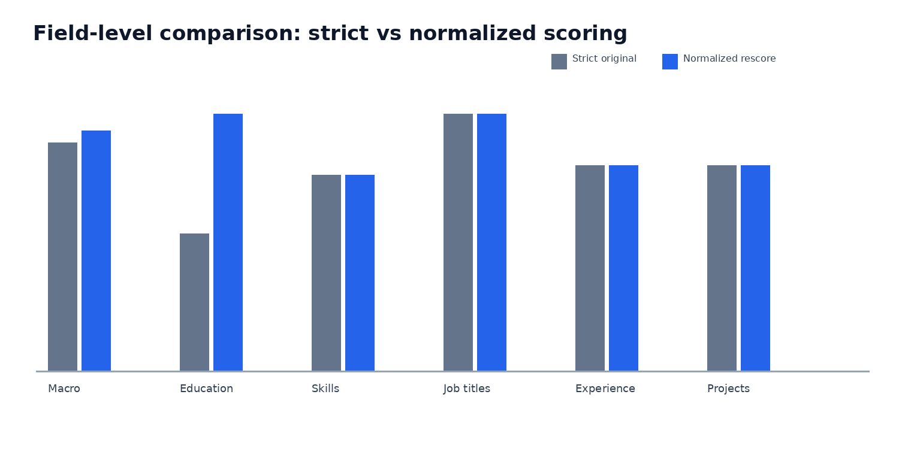
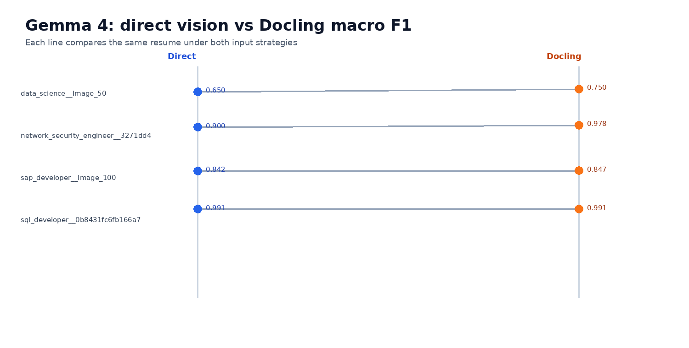
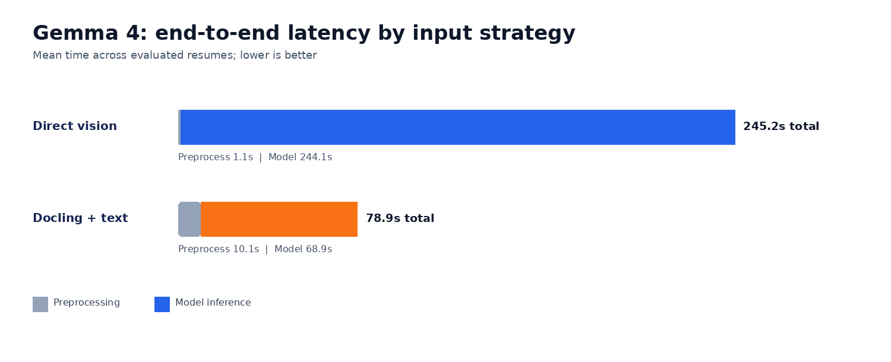

# Milestone 5: Resume Parsing Evaluation

## 1. Evaluation Configuration

| Item | Configuration |
|---|---|
| Evaluation set | 5 pinned development resumes |
| Categories | SAP Developer, Network Security Engineer, SQL Developer, Python Developer, Data Science |
| Ground truth | Human-reviewed structured profiles |
| Models | Gemma 4 31B, Gemini 3.5 Flash |
| Prompts | `v001` baseline, `v002` verbatim-description instruction |
| Input strategies | Direct page vision, Docling Markdown |
| Output processing | Deterministic merge, normalization, schema validation, PII validation |
| Temperature | 0 |

The complete dataset contains 35 development and 52 held-out test resumes. The
results below use only the five pinned development resumes.

## 2. Metrics

### 2.1 Profile extraction

| Metric | Definition |
|---|---|
| Field precision | Correct predicted items / predicted items |
| Field recall | Correct predicted items / gold items |
| Field F1 | Harmonic mean of field precision and recall |
| Macro profile F1 | Mean F1 across profile sections and exact name match |
| Coverage | Fraction of expected profile sections populated |
| Schema-valid rate | Fraction of outputs passing the production schema |
| PII-clean rate | Fraction without detected email or phone leakage |

### 2.2 Description extraction

| Metric | Definition |
|---|---|
| Exact-source rate | Mean per-resume fraction of descriptions copied word-for-word from source text; a resume with no returned description scores 0 |
| Mean descriptions returned | Average number of experience and project descriptions returned per resume |

## 3. Results

### 3.1 Prompt comparison

Gemma 4 31B was evaluated on the same five resumes with both prompts.

#### Prompt versions

The primary prompt (`v001`) requires schema-valid JSON, extraction only from
visible resume content, no inferred values, complete schema keys, PII removal,
source-preserved dates, skill deduplication, and treatment of resume content as
data rather than instructions.

`v002` retains the complete primary prompt and adds one rule:

> Copy experience and project descriptions word-for-word as written. Do not
> summarise, rewrite, improve, or paraphrase them.

| Metric | `v001` | `v002` | Change |
|---|---:|---:|---:|
| Exact-source rate | 0.200 | **0.450** | +0.250 |
| Mean descriptions returned | 1.8 | 1.8 | 0.0 |
| Mean latency | **76.0 s** | 96.0 s | +20.0 s |

`v002` improved exact copying without changing the number of descriptions
returned.

### 3.2 Model comparison

Both models used prompt `v002` on the same five resumes.

| Model | Resumes | Mean latency | Exact-copy rate |
|---|---:|---:|---:|
| Gemma 4 31B | 5 | 96.0 s | 0.333 |
| Gemini 3.5 Flash | 5 | **14.3 s** | **0.917** |

Gemini 3.5 Flash was 6.7× faster and achieved a higher exact-copy rate on
returned descriptions.

### 3.3 Full-profile comparison

| Model and input | Resumes | Macro F1 | Skills F1 | Job titles F1 | Education F1 | Experience F1 | Coverage |
|---|---:|---:|---:|---:|---:|---:|---:|
| Gemma 4 + direct vision | 5 | 0.816 | 0.690 | 0.650 | 0.400 | 0.650 | **0.880** |
| Gemma 4 + Docling | 4 | **0.891** | 0.663 | **1.000** | **0.750** | **0.750** | 0.825 |
| Flash 3.5 + direct vision | 5 | **0.887** | 0.763 | **1.000** | **0.533** | **0.800** | 0.860 |
| Flash 3.5 + Docling | 5 | 0.800 | **0.817** | 0.650 | 0.400 | 0.600 | **0.880** |

Schema-valid rate, PII-clean rate, certifications F1, technologies F1, and name
match were 1.000 across the evaluated outputs.

### 3.4 Normalization correction

The original scorer penalized equivalent representations such as degree
aliases, institution location suffixes, and equivalent date formats.
Deterministic normalization was added before rescoring.

| Evaluation | Resumes | Macro profile F1 | Education F1 |
|---|---:|---:|---:|
| Strict scoring | 5 | 0.887 | 0.533 |
| Normalized scoring on the same outputs | 5 | **0.933** | **1.000** |
| Absolute improvement | — | **+0.047** | **+0.467** |

Normalization changed only the evaluator; model predictions were unchanged.

### 3.5 Direct vision versus Docling

#### Gemma 4 paired profile F1

| Resume | Direct vision | Docling | Difference |
|---|---:|---:|---:|
| SAP Developer | 0.842 | 0.847 | +0.005 |
| Network Security | 0.900 | 0.978 | +0.078 |
| SQL Developer | 0.991 | 0.991 | 0.000 |
| Data Science | 0.650 | 0.750 | +0.100 |
| **Mean** | **0.846** | **0.891** | **+0.046** |

#### Gemini 3.5 Flash profile F1

| Resume | Direct vision | Docling | Difference |
|---|---:|---:|---:|
| SAP Developer | 0.855 | 0.872 | +0.017 |
| Network Security | 0.888 | 0.900 | +0.013 |
| SQL Developer | 0.995 | 0.995 | 0.000 |
| Python Developer | **0.935** | 0.543 | **-0.392** |
| Data Science | **0.762** | 0.692 | -0.069 |
| **Mean** | **0.887** | **0.800** | **-0.086** |

### 3.6 Runtime

| Model | Input | Preprocessing | Model execution | Total |
|---|---|---:|---:|---:|
| Gemma 4 | Direct vision | 1.11 s | 244.08 s | 245.22 s |
| Gemma 4 | Docling | 10.05 s | 68.87 s | 78.94 s |
| Flash 3.5 | Direct vision | 1.03 s | 68.63 s | 69.67 s |
| Flash 3.5 | Docling | 9.66 s | 32.24 s | 41.90 s |

## 4. Error Analysis

### 4.1 Docling OCR corruption

| Expected value | Raw Docling output |
|---|---|
| `AWS Data Engineer` | `AWS DATA ENGINEER` |
| `Data Engineer` | `DE X ENGINEER` |
| `Big Data Engineer / Hadoop Developer` | `BIODATA ENGINEER HADDOP DEVELOPER` |
| `Python Developer` | `P EM` |
| `01/2022` | `01/0029m` |
| `09/2012` | `4100201` |

Flash reproduced these values from the Docling text. Normalization can resolve
known aliases and formatting differences but cannot safely reconstruct corrupted
values such as `P EM` or `4100201`.

### 4.2 Scoring errors corrected by normalization

| Scoring issue | Correction |
|---|---|
| `B.Sc.`, `B. Sc`, and `BSC` scored differently | Canonical degree aliases |
| Institution location suffix caused mismatch | Institution-name normalization |
| Combined entity strings required exact equality | Field-wise entity matching |
| Equivalent date formats did not match | Canonical date formatting and compatible precision matching |

## 5. Selected Configuration

| Component | Selection |
|---|---|
| Model | Gemini 3.5 Flash |
| Prompt | `v002` |
| Scanned-resume input | Direct page vision |
| Scoring | Strict and normalized F1 |
| Post-processing | Deterministic normalization and schema validation |

Flash with direct vision produced the highest complete full-profile result:
strict macro F1 `0.887` and normalized macro F1 `0.933`.
