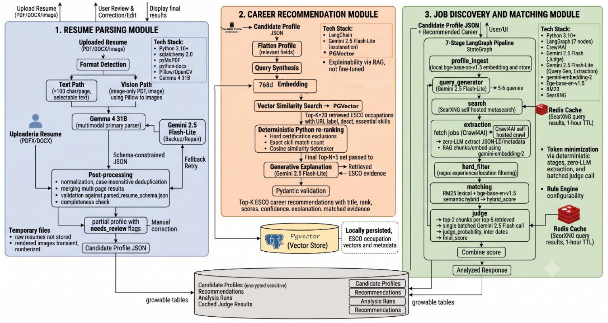
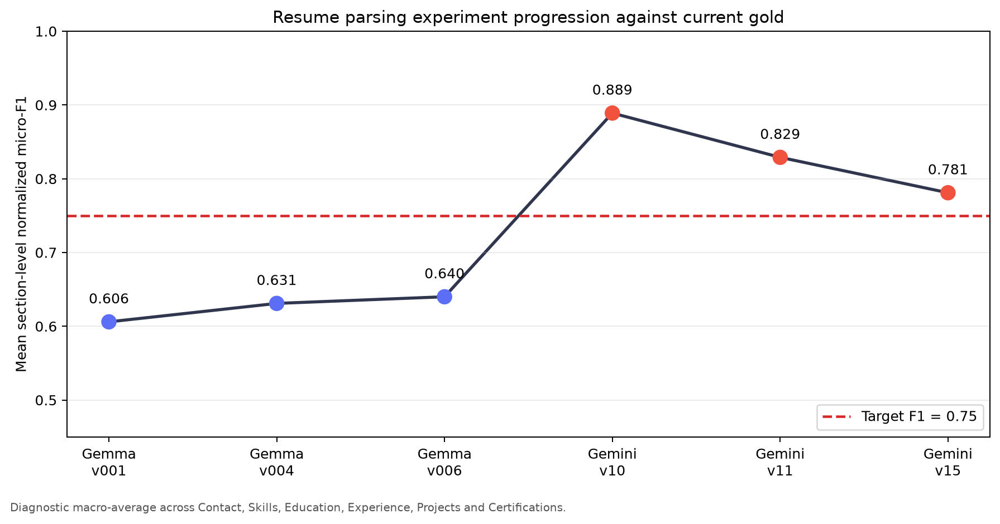
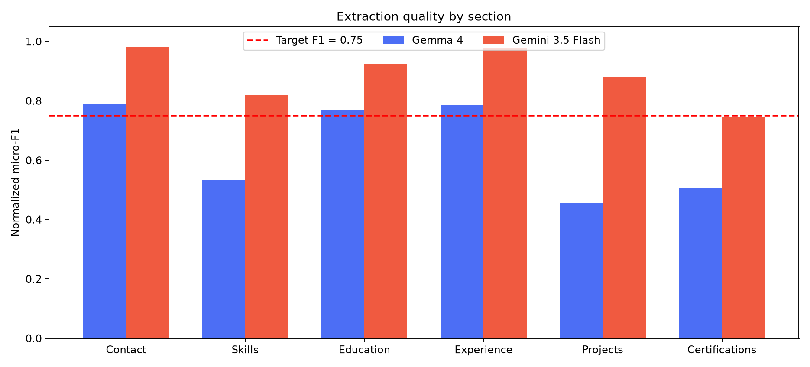
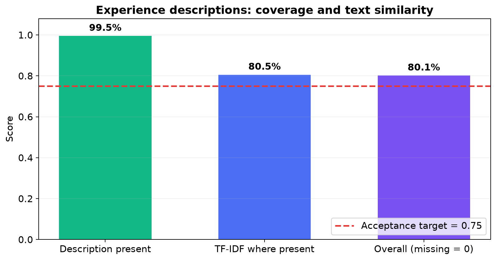
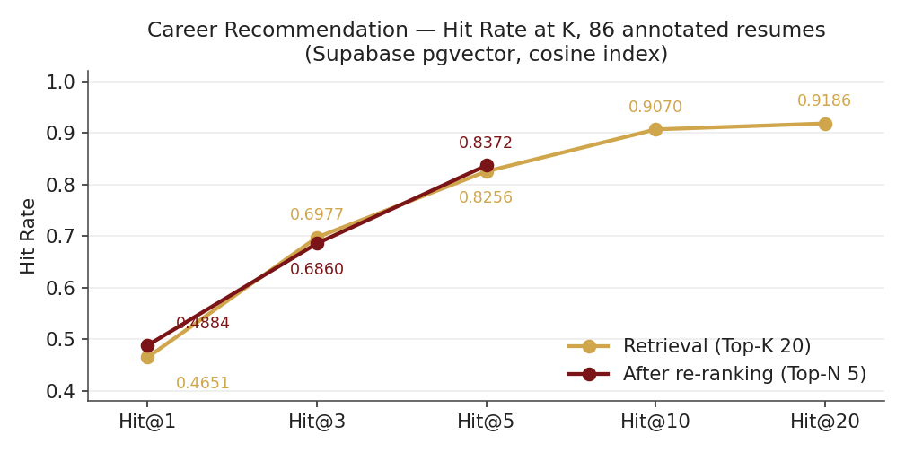
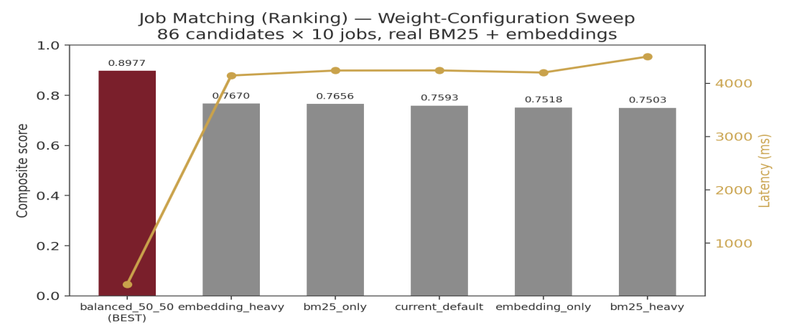
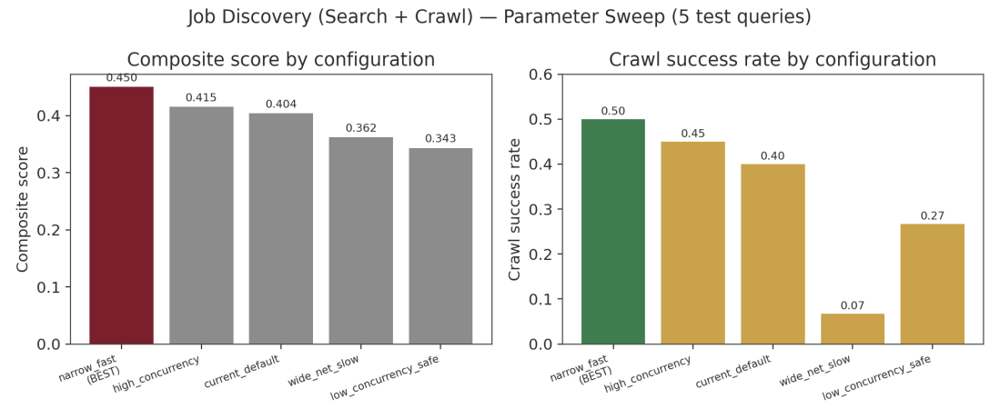

# Technical Documentation

**DiscoverMyRole — AI-Powered Intelligent Job Search and Career System**
IIT Madras · Data Science and AI Project · Group 4 · Milestone 6

This document is the reproducibility and maintenance reference. It assumes a developer audience.

## Contents

1. [Environment Setup](#1-environment-setup)
2. [Data Pipeline](#2-data-pipeline)
3. [Model Architecture](#3-model-architecture)
4. [Training Summary](#4-training-summary)
5. [Evaluation Summary](#5-evaluation-summary)
6. [Inference Pipeline](#6-inference-pipeline)
7. [Deployment Details](#7-deployment-details)
8. [System Design Considerations](#8-system-design-considerations)
9. [Error Handling and Monitoring](#9-error-handling-and-monitoring)
10. [Reproducibility Checklist](#10-reproducibility-checklist)

## 1. Environment Setup

### 1.1 Runtime and hardware

| Layer | Requirement |
|---|---|
| Backend | Python **3.12+** (the current `pyproject.toml` requires `>=3.12`), `uv`, FastAPI |
| Frontend | Node.js 20+ recommended, React 19, TypeScript 5.7, Vite 6 |
| Containers | Docker Engine with Docker Compose v2 |
| Database | PostgreSQL 16; production/evaluation vector retrieval uses Supabase PostgreSQL with `pgvector` |
| Local model | `BAAI/bge-base-en-v1.5`, 768-dimensional embeddings, CPU execution |
| Hosted models | Google AI Studio/Vertex-compatible Gemini and Gemma endpoints, configured through environment variables |
| Memory | 8 GB RAM minimum; 16 GB recommended for the backend, browser automation, and local embedding model |
| GPU | Not required. No model is trained locally; generative models are called through hosted APIs |

Exact backend versions are recorded in [`backend/uv.lock`](../backend/uv.lock); direct dependencies are declared in [`backend/pyproject.toml`](../backend/pyproject.toml). Frontend packages are declared in [`frontend/package.json`](../frontend/package.json).

### 1.2 Recommended installation: Docker Compose

```bash
git clone https://github.com/devgupta1907/Group-4-DS-and-AI-Lab-Project.git
cd Group-4-DS-and-AI-Lab-Project
cp backend/.env.example backend/.env

# Generate a Fernet key and place it in PROFILE_ENCRYPTION_KEY.
python -c "from cryptography.fernet import Fernet; print(Fernet.generate_key().decode())"

# Add GOOGLE_API_KEY and Supabase credentials to backend/.env, then:
docker compose up --build
```

Open the UI at `http://localhost:8080`. The Compose stack starts PostgreSQL, SearXNG, the FastAPI backend, and the frontend. The backend health check is `GET /health`.

For development with hot reload:

```bash
docker compose -f docker-compose.yml -f docker-compose.dev.yml up --build
```

The development UI is served at `http://localhost:5173` and the API at `http://localhost:8000`. Interactive OpenAPI documentation is available at `http://localhost:8000/docs`.

### 1.3 Native backend setup

```bash
cd backend
uv sync --dev
cp .env.example .env
uv run alembic upgrade head
uv run uvicorn main:app --reload --host 0.0.0.0 --port 8000
```

Required secrets and service settings are documented in [`backend/.env.example`](../backend/.env.example). Do not commit the populated `.env` file.

### 1.4 Configuration

All model identifiers, API keys, and connection strings live in environment configuration, never in source—so a retired or rate-limited provider can be swapped without a code change. A committed `.env.example` lists every key with placeholder values; no real secret is committed.

Required variables:

| Variable | Purpose |
|---|---|
| `GOOGLE_API_KEY` | Gemini API key—<https://aistudio.google.com/apikey> |
| `SUPABASE_URL` | Supabase project URL (Settings > API) |
| `SUPABASE_SERVICE_KEY` | Service role key (Settings > API) |
| `SUPABASE_DB_URL` | `postgresql://postgres.<ref>:<password>@...pooler.supabase.com:6543/postgres` |
| `DATABASE_URL` | Same host, prefixed `postgresql+asyncpg://` |
| `PROFILE_ENCRYPTION_KEY` | Field-level encryption of retained sensitive profile fields |
| `SEARXNG_URL` | `http://localhost:8888` for the native local setup; Docker Compose supplies the internal service URL |

`SUPABASE_DB_URL` **must** use port 6543 (transaction pooler). `DATABASE_URL` **must** carry the `+asyncpg` driver prefix—SQLAlchemy async requires it and the application will not start without it.

Generate the encryption key once:

```bash
python -c "from cryptography.fernet import Fernet; print(Fernet.generate_key().decode())"
```

## 2. Data Pipeline

### 2.1 Datasets and licensing

| Dataset | Size/version | Use | Location and licensing note |
|---|---:|---|---|
| Resume corpus | 8,905 single-page, image-only PDFs; 43 canonical categories | Resume parsing development and evaluation | Originally sourced from Kaggle (`hadikp/resume-data-pdf`). The selected raw resume PDFs are stored in [`data/resume_dataset_pdf.zip`](../data/resume_dataset_pdf.zip) and [`data/resume_dataset.zip`](../data/resume_dataset.zip). Retain the source dataset's terms and do not redistribute resumes containing personal data without authorization |
| ESCO taxonomy | v1.2.1 English: 3,039 occupations, 13,939 skills, 126,051 occupation–skill relations | Retrieval knowledge base | Indexed into Supabase/pgvector. ESCO is published by the European Commission; preserve ESCO attribution and consult its official reuse notice when redistributing derived data |
| Career labels | 134 category-to-occupation mappings over 43 categories | Retrieval/ranking ground truth | [`backend/src/career_recommendation/evaluation/`](../backend/src/career_recommendation/evaluation/) |
| Job Matching gold set | 86 candidates × 10 jobs = 860 candidate–job pairs | Ranking evaluation | Derived from the LinkedIn Job Postings Dataset; local evaluation input is under `data/` and `backend/tests/job_discovery_matching/`. Observe the upstream dataset's license/terms |
| Live job search set | 5 live queries, 4 candidate profiles, 2 job batches | Search/crawl and prompt sweeps | Promptfoo configurations and checked-in results under [`backend/tests/job_discovery_matching/`](../backend/tests/job_discovery_matching/) |

The repository contains personal-data-bearing resume samples. Treat them as restricted evaluation data: do not expose them from a public deployment, logs, screenshots, or commits.

### 2.2 Resume preparation and parsing

The demonstrated workflow consists of two parts.

**Dataset preparation**

1. Scan PDFs and record category, file size, page count, text-layer availability, image count, and image resolution.
2. Map folder names to canonical job categories.
3. Detect exact duplicates using MD5 hashes.
4. Detect near-duplicates using perceptual hashes.
5. Select category-balanced resumes for the gold set.
6. Create the development and test split using seed 42.
7. Copy the selected PDFs and create skeleton JSON records.
8. Render resume pages for annotation.

**Draft annotation**

1. Load `parsed_resume_schema.json`.
2. Load the annotation guidelines and worked example.
3. Render the first resume page at 150 DPI.
4. Send the image, schema, guidelines, and example to the vision model.
5. Request JSON-only output.
6. Parse the response as JSON.
7. Validate it using `Draft7Validator`.
8. Save the result as a draft with `_annotated: false` for human review.

The subsequent evaluation used **86 human reviewed resumes across 43 job categories**. The dataset was used for evaluation and error analysis only; no training or fine-tuning was performed. Versioned overlays preserve the original annotations.

At runtime, a resume is routed by the text-layer probe, rendered page by page where required, sent to the parser with the schema prompt, and the returned JSON is validated, merged across pages, normalised, and deduplicated. The fallback retries path and the partial-profile-with-review-flags path both function.

### 2.3 ESCO ingestion and retrieval preparation

The Career Recommendation module flattens the candidate profile into a query, embeds it (`BAAI/bge-base-en-v1.5`, 768 dimensions, local CPU), retrieves the 20 nearest ESCO occupations from a Supabase pgvector index (HNSW, cosine), re-ranks to the top 5 by blending semantic similarity with exact skill overlap, and calls an LLM to explain each recommendation, grounded strictly in the retrieved evidence. The model may only cite occupations and skills that were actually retrieved, and every returned occupation URI is validated before the response leaves the module.

The ESCO occupation set functions as the complete retrieval knowledge base. Withholding occupations would degrade the system rather than create a meaningful held-out condition, since a candidate cannot be matched to an occupation that is absent from the index.

The rebuild endpoint is `POST /api/career/index/rebuild`; progress can be checked using `GET /api/career/health`. Rebuilding truncates and rewrites the index, so concurrent rebuilds are rejected.

### 2.4 Job Discovery and Matching preparation

All seven pipeline stages are implemented and run in sequence against live search. Query generation, SearXNG search with Redis caching, Crawl4AI extraction on a job-store miss, regex hard filtering, hybrid BM25 and embedding ranking, and the batched judge call all function, and the ranked shortlist of five jobs is returned with scores and rationale. The global job store correctly skips crawling for postings already held.

For offline evaluation, the Job Matching golden set contains 86 candidates with a fixed 10-job pool each: 860 postings from the LinkedIn Job Postings Dataset. Candidate identifiers are divided before pair construction at 60/20/20. The evaluation copy is stored in [`data/Job_Matching_Eval_dataset.xlsx`](../data/Job_Matching_Eval_dataset.xlsx), with processed Promptfoo data and configurations under [`backend/tests/job_discovery_matching/`](../backend/tests/job_discovery_matching/).

Milestone 5 used five live search queries, four candidate profiles, and two job-batch cases. Coverage is 1.0 in every configuration tested. Crawl success is the open reliability problem: the best configuration reaches 0.50.

## 3. Model Architecture

The system follows a three-module pipeline. First, the Resume Parsing module processes the uploaded resume and produces a validated Candidate Profile. Next, the Career Recommendation module uses the Candidate Profile to retrieve and rank occupations from the ESCO taxonomy and generate grounded explanations. Finally, the Job Discovery and Matching module uses the candidate profile and recommended roles to discover, filter, rank, and evaluate live job postings.



*Figure 1. Overall architecture and data flow across Resume Parsing, Career Recommendation, Job Discovery and Matching, shared storage, retrieval, and caching.*

| Module | Receives | Produces | Interaction with next stage |
|---|---|---|---|
| Resume Parsing | Uploaded resume | Structured candidate profile | Supplies the common Candidate Profile JSON. |
| Career Recommendation | Candidate Profile JSON | Top-K ESCO career recommendations | Passes recommended roles and explanations to Job Discovery and Matching. |
| Job Discovery and Matching | Candidate profile + recommended roles | Ranked jobs and match explanations | Returns the fit score, category breakdown, matched and gap skills, and recruiter-style recommendation to the user interface. |

### 3.1 Final component configuration

| Module | Component | Final configuration |
|---|---|---|
| Resume Parsing | Primary parser | Multimodal Gemma/Gemini-family model selected by `RESUME_PRIMARY_MODEL`; one page per call, temperature 0 |
| Resume Parsing | Repair path | `RESUME_FALLBACK_MODEL`; one retry after schema failure, then partial profile plus review flags |
| Resume Parsing | Routing | Vision-first for scanned documents; 100-character text-layer probe; 150 DPI; maximum 10 pages and 10 MiB by default |
| Career Recommendation | Encoder | `BAAI/bge-base-en-v1.5`, 768 dimensions, local CPU |
| Career Recommendation | Vector store | Supabase PostgreSQL/pgvector, cosine HNSW; retrieve Top-K = 20 |
| Career Recommendation | Re-ranker | Semantic similarity plus skill bonus 0.02; essential/optional skill weights 1.0/0.5; return Top-N = 5 |
| Career Recommendation | Explanation | Gemini-family hosted model, temperature 0, constrained to retrieved occupation URIs and skills |
| Job Discovery | Orchestration | Seven-node LangGraph state graph |
| Job Discovery | Search/crawl | SearXNG; max results 5; crawl limit 3; concurrency 3; timeout 8,000 ms |
| Job Matching | Ranker | BM25 0.5 + embedding similarity 0.5; shortlist 15 |
| Job Matching | Judge | Gemma-family hosted model; hybrid/judge weights 0.8/0.2; two retrieved chunks per job |

Model identifiers are environment-controlled because hosted model names retire or change. For exact reproduction of a historical evaluation, record the resolved identifiers alongside the run, rather than relying only on aliases in `.env`.

## 4. Training Summary

This system performs no gradient-based training. No weights are initialised, updated, or saved anywhere in the pipeline, because the project has no labelled training data of the kind these tasks would require. Several conventional headings, optimiser, learning rate, epochs, loss curves, checkpoint selection, therefore have no direct instance here. They are not skipped but mapped to its working equivalent in the configuration summary that follows.

| Conventional activity | Equivalent in this system |
|---|---|
| Trainable weights, optimiser, learning rate | None; no gradients are computed. The configurable surface is prompts, schemas, retrieval parameters, and scoring weights, chosen by exhaustive sweeps over small discrete grids |
| Batch size | Survives only as a cost measure: the judge scores five shortlisted jobs in one call, and the parser sends one page image per call |
| Number of epochs | No repeated passes over training data. The occupation index is built in a single offline pass |
| Loss function | Deterministic rule-based validators combined into a weighted composite score, which is the quantity each sweep maximises |
| Early stopping | An explicit three-condition stopping criterion for prompt refinement, and a fixed exhaustive grid for parameters |
| Checkpoint selection | Configuration-bundle selection; the winning bundle is the artefact the system runs on |
| Regularisation | Schema constraints, evidence grounding, URI validation, and permissive filtering, which control fluent but unsupported output |
| Training duration, loss curves | Index build time and evaluation runtime; the parameter sweep curve is the equivalent diagnostic |

Prompt refinement stops on three stated conditions rather than on visible improvement: field extraction is stable across repeated runs on the same input, no schema violations occur on the development split, and no new error class appears relative to the previous prompt version. Parameter selection stops when the sweep grid is exhausted.

## 5. Evaluation Summary

### 5.1 Resume Parsing

The experiments produced the following final configuration:

- **Model:** Gemini 3.5 Flash.
- **Input route:** vision-only extraction from resume page images rendered at 150 DPI.
- **Sampling:** temperature 0 with medium thinking level.
- **Output contract:** JSON structured output validated against the production resume schema.
- **Privacy:** email addresses and telephone numbers are excluded; locations retain only the city.
- **Skills:** preserve complete competency phrases, but split explicit enumerations of named tools and technologies.
- **Experience descriptions:** copy visible text without summarising or paraphrasing.
- **Job titles:** extract each experience title once and derive the top-level list deterministically.
- **Missing information:** return `null` for missing scalar values and empty lists for missing sections.
- **Evaluation:** field-level micro-precision, recall and F1 over all 86 resume images, with a reported F1 target of 0.75.

| Section | F1 | Result |
|---|---:|---|
| Contact | 0.98 | Pass |
| Skills | 0.82 | Pass |
| Education | 0.92 | Pass |
| Experience | 0.98 | Pass |
| Projects | 0.88 | Pass |
| Certifications | 0.75 | Pass |

#### Experiment progression



*Figure 2. Diagnostic mean of the six section-level normalized micro-F1 scores against the final reference dataset. Regressions are retained because they justify why apparently reasonable prompt changes were removed.*

#### Gemma 4 versus Gemini 3.5 Flash



*Figure 3. Section-level F1 for the best completed Gemma 4 and Gemini 3.5 Flash configurations.*

| Model | Contact | Skills | Education | Experience | Projects | Certifications |
|---|---:|---:|---:|---:|---:|---:|
| Gemma 4 | 0.79 | 0.53 | 0.77 | 0.79 | 0.45 | 0.51 |
| Gemini 3.5 Flash | **0.98** | **0.82** | **0.92** | **0.98** | **0.88** | **0.75** |

Gemini 3.5 Flash produced the higher F1 in every section. The largest gains were Projects (+0.43), Certifications (+0.24) and Skills (+0.29), the three weakest Gemma 4 sections. This is a comparison of the best completed evaluated configurations, so it measures the deployed model-and-prompt combinations rather than model architecture alone.

#### Experience-description analysis

Descriptions were compared only between corresponding experience entries. Missing predicted positions scored zero; present text used TF-IDF cosine similarity because exact string equality would over-penalize punctuation and OCR spacing.



*Figure 4. Experience-description coverage, mean TF-IDF cosine similarity for present descriptions, and the overall score after assigning zero to missing positions.*

| Measure | Score |
|---|---:|
| Corresponding descriptions present | 99.52% |
| Mean TF-IDF cosine where present | 0.81 |
| Overall description score, with missing positions = 0 | **0.80** |

The 0.80 overall score exceeds the 0.75 acceptance target while still penalizing omitted descriptions. TF-IDF was used only for this long-text field; structured fields retained item-level precision, recall and F1.

### 5.2 Career Recommendation

| Evaluation | MRR | Hit@1 | Hit@3 | Hit@5 | Hit@10 | Hit@20 |
|---|---:|---:|---:|---:|---:|---:|
| Retrieval, Top-20 (86 resumes) | 0.6110 | 0.4651 | 0.6977 | 0.8256 | 0.9070 | 0.9186 |
| Re-ranked, Top-5 (86 resumes) | 0.6105 | 0.4884 | 0.6860 | 0.8372 | — | — |
| Re-ranked, held-out 52 resumes | 0.6359 | 0.5192 | 0.7500 | 0.8269 | — | — |



*Figure 5. Hit Rate at K for retrieval and for the re-ranked output on the full annotated set. Re-ranking operates only within the top five, so it has no value at K of 10 or 20.*

Re-ranking lifts Hit Rate at 1 from 0.4651 to 0.4884 and Hit Rate at 5 from 0.8256 to 0.8372, holding MRR within 0.0005 of retrieval. The per-record diagnostic explains that near-tie: 3 records improved, 3 worsened, and 7 lost an acceptable occupation to the truncation from twenty candidates down to five. The module produced a ranked list for every profile—86 of 86 evaluated, 0 failures.

On the held-out split the selected configuration matches retrieval at ranks 1 and 3, improves Hit Rate at 5 from 0.8077 to 0.8269, and holds MRR within 0.008 of retrieval. Those figures sit at or above the corresponding full-set figures, which is the pattern consistent with a configuration that is not overfitted to the set it was chosen on.

The migration to the hosted store also improved retrieval, because the previous index used the store's default distance while the new one uses an explicit cosine operator class. With chunk definition, encoder, and query construction unchanged, retrieval Hit Rate at 5 rose from 0.7791 to 0.8256.

### 5.3 Job Discovery and Matching

| Stage | Selected result | Main interpretation |
|---|---|---|
| Job ranking | Composite 0.8977; Precision@5 0.8486; NDCG@10 0.9795; Spearman 0.8767; 226 ms; pass 94.6% | Ranking quality was nearly flat across weights; the 0.5/0.5 configuration won mainly on latency |
| Search and crawl | Coverage 1.0; crawl success 0.50; 2,703 ms | Coverage is sufficient, but half of crawl attempts still fail |
| Query generation | Composite 0.5102; schema 1.0; diversity 0.8010; pass 100% | All variants were structurally correct; latency selected the winner |
| LLM judge | Composite 0.2750; schema 0.50; calibration 0.50; pass 0% | Negative result: the judge is not reliable enough for an unattended decision path |

#### Job Matching ranking-weight sweep



*Figure 6. Composite score (bars) and latency (line) across the six ranking-weight configurations. Ranking quality is flat; latency decides the winner.*

#### Job Discovery search-and-crawl sweep



*Figure 7. Composite score and crawl success rate across the five search-and-crawl configurations. Coverage is saturated at 1.0 everywhere and is not plotted separately.*

## 6. Inference Pipeline

### 6.1 End-to-end data flow

1. The browser uploads a PDF, DOCX, PNG, or JPEG to `POST /api/resume-parsing/resumes`.
2. The API streams Server-Sent Events: `stage`, then either `profile` or `error`, followed by `done`.
3. The parsing service checks limits and document type, extracts or renders pages, calls the configured parser, validates output, retries once when needed, merges pages, removes duplicates, encrypts sensitive fields, and stores the profile.
4. The client submits the returned `profile_id` to `POST /api/career/recommend`.
5. Career Recommendation retrieves/decrypts the profile through Resume Parsing's public service, maps schemas, embeds the profile, retrieves 20 ESCO candidates, re-ranks five, generates grounded explanations, and persists provenance.
6. `POST /api/jobs/search` reads the same stored profile, generates queries, searches, crawls, filters, ranks, judges, persists the run, and returns jobs.
7. The frontend reads saved outputs through profile-scoped GET endpoints and renders the consolidated report.

### 6.2 API example

```bash
# 1. Upload. Keep the stream open and copy profile_id from the profile event.
curl -N -X POST http://localhost:8000/api/resume-parsing/resumes \
  -H 'X-Dev-User-Id: dev-user' \
  -H 'X-Dev-User-Email: dev@example.com' \
  -F 'file=@/absolute/path/to/resume.pdf'

# 2. Generate career recommendations.
curl -X POST http://localhost:8000/api/career/recommend \
  -H 'Content-Type: application/json' \
  -H 'X-Dev-User-Id: dev-user' \
  -H 'X-Dev-User-Email: dev@example.com' \
  -d '{"profile_id":"<PROFILE_UUID>"}'

# 3. Discover jobs for the stored profile.
curl -X POST http://localhost:8000/api/jobs/search \
  -H 'Content-Type: application/json' \
  -H 'X-Dev-User-Id: dev-user' \
  -H 'X-Dev-User-Email: dev@example.com' \
  -d '{"profile_id":"<PROFILE_UUID>","target_location":"India","remote_only":false}'
```

### 6.3 Model access and expected runtime

No checkpoints are downloaded or hosted by this project. Gemini models are called over the hosted API using `GOOGLE_API_KEY`. `bge-base-en-v1.5` is pulled automatically from Hugging Face on first run and cached locally by `sentence-transformers`.

| Stage | Measured | Notes |
|---|---|---|
| Resume parsing, per resume | 19.03 s median, 21.79 s mean, 80.26 s max | Over all 86 gold resumes on the selected parser |
| Career Recommendation, per profile | 1.5–1.8 s | 132–158 s across all 86 profiles; dominated by network round-trip to the hosted database region, not computation |
| Job Matching ranking | 226 ms | Deterministic scoring only, no model call |
| Job Discovery, API path | Within 2 minutes | Across 45 domains retrieved during evaluation |
| Job Discovery, fallback crawl | 2,703 ms typical | Invoked only when the primary API has no coverage |
| Batched judge call | 21,572 ms median; one case 178,664 ms | Exceeds its own 20-second ceiling |
| ESCO index build | Minutes on CPU | One offline pass over 3,039 documents |

## 7. Deployment Details

### 7.1 Platform

**AWS EC2 (t3.medium)** — `http://13.235.73.185:8080/`, live for the duration of the viva.

The instance runs on a paid t3.medium rather than the free tier because the BGE embedding model (~450 MB) plus the full application stack exceed free-tier resources. The repository additionally ships a Dockerfile for the FastAPI backend, a Dockerfile for the React frontend, and a `docker-compose.yml` that starts the full stack—PostgreSQL, SearXNG, Alembic migrations, backend, and frontend—together.

### 7.2 How the models are hosted

Nothing is model-served by this project. Gemini models are hosted APIs called per request. `bge-base-en-v1.5` runs **in-process on CPU** inside the backend, loaded once at startup as a single shared instance and reused across Career Recommendation and Job Matching. The externally hosted service required at runtime is Supabase PostgreSQL.

### 7.3 Ports

| Service | Port | Notes |
|---|---:|---|
| Frontend (Vite development server) | 5173 | `npm run dev` |
| Frontend (Docker / EC2) | 8080 | `docker compose up --build` |
| FastAPI backend | 8000 | `uv run uvicorn main:app --reload` |
| SearXNG | 8888 | Self-hosted metasearch |
| Supabase PostgreSQL | 6543 | Transaction pooler |

### 7.4 Endpoints

| Endpoint | Method | Purpose |
|---|---|---|
| `/health` | GET | Liveness check—returns `{"status":"ok"}` |
| `/docs` | GET | FastAPI Swagger UI |
| `/api/resume-parsing/resumes` | POST | Upload and parse a resume with SSE progress |
| `/api/career/recommend` | POST | Ranked ESCO recommendations with explanations |
| `/api/jobs/search` | POST | Seven-stage job discovery and matching |
| `/api/feedback` | POST | Submit a rating, reasons, and optional comment |
| `/api/feedback/mine` | GET | Current user's past submissions |
| `/api/feedback/summary` | GET | Aggregate counts |
| `/api/feedback/reasons` | GET | Feedback reason values served by the backend |

### 7.5 How to interact

- **UI:** open the deployed URL or `http://localhost:5173` locally. Upload a resume, review the parsed profile, view recommendations and the job shortlist, and generate a career report.
- **API:** use the requests in Section 6 or the Swagger UI at `/docs`.

## 8. System Design Considerations

### 8.1 Modularity

Each module is a self-contained package under `backend/src/` with its own router, service, schemas, and internal implementation. Cross-module communication happens through versioned JSON contracts—the Candidate Profile and the recommendation run—not through shared internals.

An import-linter contract set enforces the architectural boundaries on every run. The Feedback module remains isolated from the recommendation and job-search paths.

### 8.2 Resume Parsing design

| Design concern | Implementation |
|---|---|
| Bounded resource use | Uploads are limited to 10 MiB and 10 pages. Pages are rendered at 150 DPI and processed one at a time, bounding image memory and model-input size |
| Responsiveness | Parsing progress is streamed through Server-Sent Events, so the client receives stage updates during the hosted-model call instead of waiting on one silent request |
| Failure isolation | Each page has an independent extraction result. Schema failure triggers one repair attempt; unresolved cases return the successfully extracted fields with review flags |
| Deterministic post-processing | Page results are merged, normalised, and deduplicated in Python. The top-level job-title list is derived from experience records rather than generated independently |
| Horizontal scaling | API workers are stateless between requests. Persisted profiles and job state live in the shared database, allowing additional backend replicas to serve uploads |
| Load constraint | Hosted-model latency and provider rate limits are the principal throughput limits. Upload and page limits cap the number of model calls generated by one request |
| Temporary data | Original uploads and rendered page images remain transient and are released after parsing rather than stored as permanent application data |
| Privacy and persistence | Email addresses and telephone numbers are excluded, locations retain only the city, and retained sensitive fields are encrypted before database storage |
| Module boundary | Career Recommendation and Job Discovery obtain decrypted profiles through the Resume Parsing service contract rather than reading its internal tables |

### 8.3 How the database and retriever interact (RAG)

**Offline, once:** each ESCO occupation becomes one chunk—a semantic atomic unit rather than a sliding window, because the taxonomy is already structured and atomic. Chunks are embedded by the local BGE encoder and written into a pgvector column with an HNSW index using the explicit cosine operator class. Measured against the default-distance index, cosine raised retrieval Hit@5 from 0.7791 to 0.8256.

**At request time:** the candidate profile is flattened into a query string and embedded by the same encoder. pgvector runs an approximate nearest-neighbour search and returns the top 20 occupations with their metadata. No embedding call is made against the taxonomy at request time; a candidate query costs one local embedding and one explanation call regardless of index size.

**Between retrieval and generation** sits a deterministic Python re-ranking stage: hard-requirement exclusions, then a blended score combining cosine similarity with normalised skill overlap at weight 0.02. This is rule-based rather than a second neural pass, so occupation ordering is reproducible and inspectable.

**Generation constraints:** the explanation model may only discuss occupations present in the retrieved set and may only name skill gaps drawn from that occupation's own ESCO skill list. Every returned URI is validated against the retrieved set, and a non-matching entry is dropped before the response leaves the server. Confidence bands are derived from deterministic evidence, not asserted by the model.

Job Discovery uses a second retrieval pattern: a global deduplicated job store keyed by a hash of the normalised posting URL. Structured fields live in relational columns for exact SQL filtering; one job-level embedding supports hybrid ranking across the whole pool; and a separate job-chunks table holds per-job chunk embeddings for RAG retrieval at judge time.

### 8.4 Data flow and sequencing

Career Recommendation and Job Discovery run sequentially. Job Discovery consumes the persisted recommendation run by profile identifier rather than an in-flight value. This sequencing prevents Job Discovery from reading a stale or missing recommendation.

### 8.5 Scalability

- **Token minimisation:** Job Discovery makes two model calls per run regardless of how many jobs are discovered.
- **Zero-LLM extraction:** structured fields come from schema.org JSON-LD or page metadata.
- **Global deduplicated job store:** a posting is crawled, parsed, and embedded once, then reused by subsequent searches until it becomes stale or expires.
- **Local embedding model:** candidate and job embeddings have no per-call API cost and are unaffected by hosted-model rate limits.
- **Persistent ESCO index:** occupation embeddings are generated once offline, so index size does not affect per-request embedding cost.
- **Stateless request path:** the application holds no per-user state between requests and can scale horizontally; the binding constraints are crawler memory and hosted-provider rate limits.

### 8.6 Security and privacy

Email addresses and telephone numbers are never extracted or persisted. Locations retain only the city. Original uploads and rendered page images are transient and are not written to persistent storage. Retained sensitive fields are encrypted at field level with `PROFILE_ENCRYPTION_KEY` and decrypted only for the authenticated owner. Every profile access is written to a separate audit log.

## 9. Error Handling and Monitoring

### 9.1 Fail-soft behaviour

Pipeline failures are handled through degraded or partial responses where valid intermediate results remain available. Across the annotated evaluation, 86 of 86 profiles returned a ranked list with zero unrecoverable failures.

| Condition | Behaviour |
|---|---|
| Parser output fails schema validation or the completeness check | One fallback retry against a second model, then a partial profile with review flags rather than nothing |
| Candidate skills produce no overlap with any retrieved occupation | Similarity-only ranking, confidence reported as low, with an explicit message to the user |
| Explanation model unavailable, or no candidates survive retrieval | Explicit degraded or no-candidates status, with the deterministic ranking intact |
| Explanation model names an occupation outside the retrieved set | Entry dropped by URI validation before the response is returned |
| Primary job source returns nothing or fails | Falls back to the SearXNG and crawl chain; an empty shortlist carries a no-matches status rather than raising |
| Crawl fails to render a posting | That URL is skipped and the run continues |
| Search returns no results for all generated queries | Empty shortlist with a no-matches status |
| Model API rate limit or quota is exceeded | HTTP 503; no silent retry loop |
| Database write fails after ranking | Error logged and shortlist still returned |
| Any pipeline node fails | Sets an error field checked by downstream nodes, short-circuiting the run |

### 9.2 Input safety

- Resume text and job descriptions are treated as untrusted data, delimited clearly, and cannot alter the system instruction.
- Every generative call is bound to a schema and validated before the output is accepted downstream.
- The hard filter in Job Discovery is permissive by design: a posting is excluded only when it states a requirement the candidate explicitly fails, because a wrongly excluded job cannot be recovered later in the pipeline.

### 9.3 Monitoring and instrumentation

| Mechanism | What it captures |
|---|---|
| Append-only JSONL evidence ledger | Outputs, schema evidence, errors, latency, and per-call token counts for every parser run |
| Audit log | Every profile access, with requesting identity, timestamp, and operation type; stored separately from profile data |
| `/health` | Application liveness |
| Recorded run provenance | Model and prompt fingerprints stored alongside recommendation results |
| Ingestion verification | Vector L2 norm and self-similarity after index construction |

## 10. Reproducibility Checklist

### 10.1 Determinism controls

| Control | Value |
|---|---|
| Random seed | **42**, fixed across split assignment and sampling |
| Temperature | **0** on every generative call |
| Output format | Schema-constrained JSON on every generative call, validated before downstream use |
| Provenance | Complete model and prompt fingerprints recorded per run |
| Database schema | Built from versioned Alembic revisions `0001` to `0005` plus a checked-in setup script |
| Gold corrections | Stored as versioned overlays that preserve the original annotations |
| Grading | All evaluation grading is deterministic and rule-based, never model-graded, so the evaluation itself stays reproducible |

Run-to-run variance is nil by construction for the deterministic stages. The uncertainty that matters is sampling uncertainty over the 86 records.

### 10.2 Checkpoints

**There are no checkpoints.** No model weights are trained, saved, or versioned by this project. The equivalent artefact is the **configuration bundle**—the prompt text, output schemas, retrieval parameters, and scoring weights recorded in Section 3, which is what the system actually runs on.

The one persistent build artefact is the ESCO vector index in Supabase: 3,039 × 768-dimensional vectors plus index structure and document text.

### 10.3 Reproduction workflow

| Stage | Action |
|---|---|
| **Clone** | `git clone https://github.com/devgupta1907/Group-4-DS-and-AI-Lab-Project.git` |
| **Configure** | Copy `backend/.env.example` to `backend/.env` and populate the database, encryption, Google API, and Supabase values |
| **Install backend** | `cd backend && uv sync` |
| **Install frontend** | `cd frontend && npm install` |
| **Migrate** | `cd backend && uv run alembic upgrade head` |
| **Run complete stack** | `docker compose up --build` |
| **Run backend tests** | `cd backend && uv run pytest` |
| **Run architecture checks** | `cd backend && uv run lint-imports` |
| **Run frontend checks** | `cd frontend && npm run typecheck && npm run lint && npm run build` |

The ESCO occupation index is already built and populated in the shared Supabase project, so there is no ingestion step in normal setup. A fresh Supabase project requires one index build before Career Recommendation can return results.

### 10.4 Reproducing the reported figures

- **Resume Parsing and Career Recommendation:** run the evaluation harness against the corrected 86-record gold set. Saved predictions are reused and scores are recomputed without another model call, making the scoring run deterministic for the same predictions.
- **Job Matching:** run the evaluation against the 86-candidate × 10-job golden set with BM25 and embedding scoring at temperature 0.
- **Job Discovery:** requires live network access to the job source, SearXNG, and Crawl4AI. Results vary as live postings and websites change; the reported values are measurements from the recorded evaluation run.

### 10.5 Verification status

| Check | Command | Expected result |
|---|---|---|
| Backend test suite | `cd backend && uv run pytest` | Tests pass |
| Architecture contracts | `cd backend && uv run lint-imports` | All contracts kept, none broken |
| Frontend type check | `cd frontend && npm run typecheck` | Exit code 0 |
| Frontend lint | `cd frontend && npm run lint` | Exit code 0 |
| Frontend build | `cd frontend && npm run build` | Production bundle generated |
| Backend liveness | `curl http://localhost:8000/health` | `{"status":"ok"}` |
