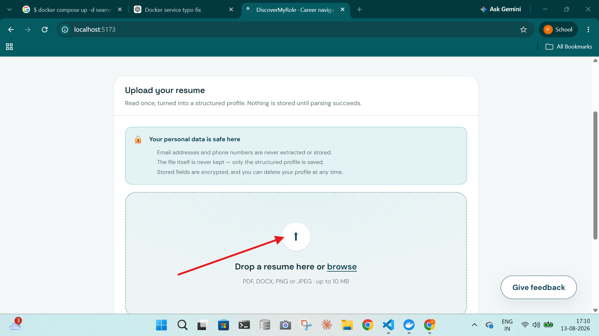
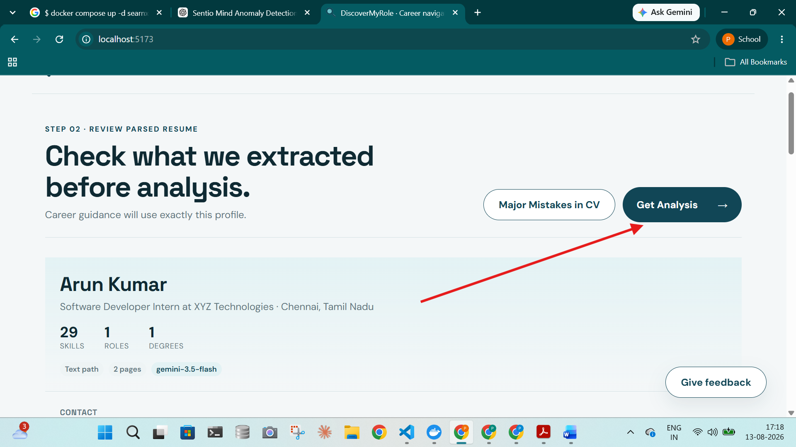
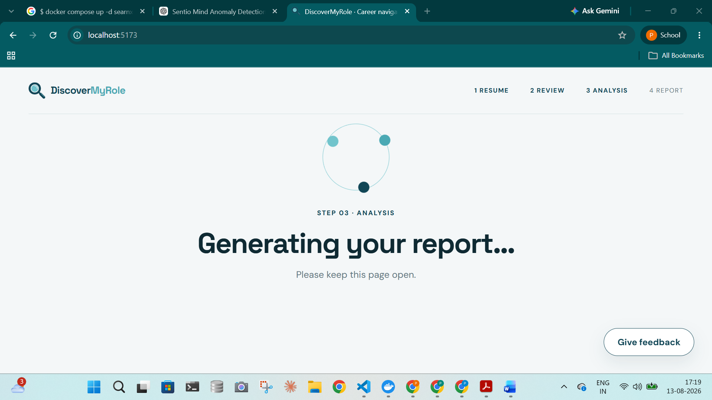
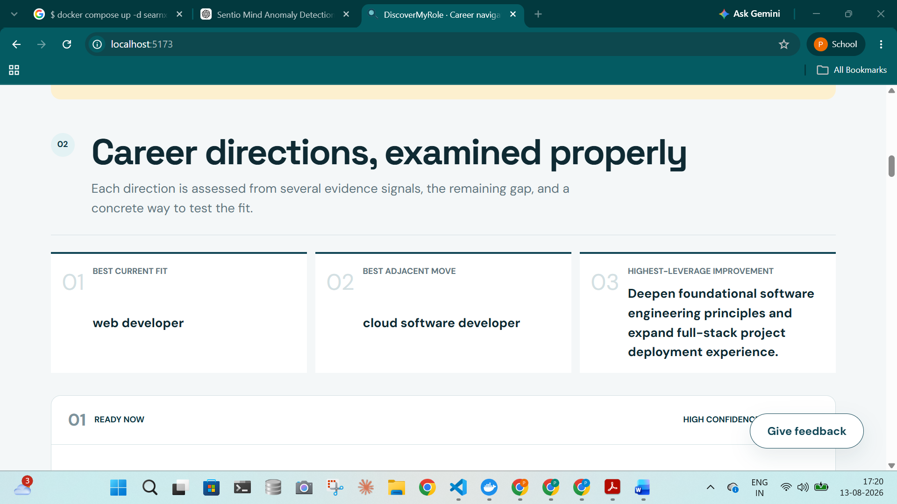
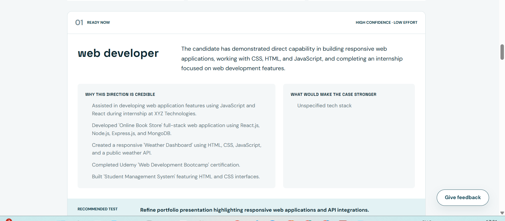
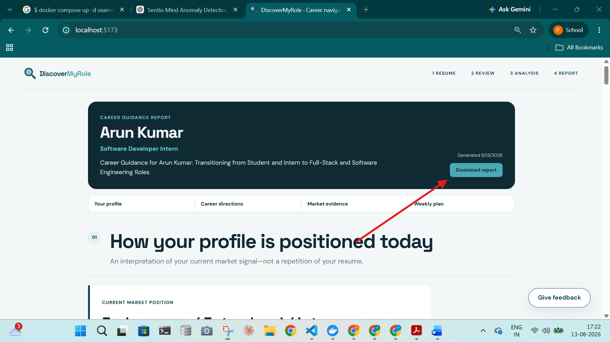

# User Documentation
### AI-Powered Intelligent Job Search and Career System

---

## 1. App Overview

The AI-Powered Intelligent Job Search and Career System helps job seekers identify suitable career paths and jobs based on their resume. It provides career recommendations, job matches, strengths, weaknesses, and career development suggestions, and current market position.

## 2. Steps to Launch the Application

Open the URL (refer to the technical documentation).

## 3. Input

Upload your resume in formats such as PDF or DOC/DOCX.

## 4. Output

After resume analysis, the system generates a career report containing the candidate's profile, career recommendations, suitable job roles, strengths, skill gaps, and career development suggestions. It also provides recommended career pathways, short-term and long-term action plans, and discovered job opportunities with an Apply/Skip recommendation, interview probability, matching strengths, and skill gaps.

## 5. How to Use

| Step | Action |
|------|--------|
| 1 | Open the application. |
| 2 | Upload your resume in the upload/Dropbox section. |
| 3 | Wait for the resume to be processed. |
| 4 | Click Generate Analysis. |
| 5 | Wait for the report to be generated. |
| 6 | Review and click Download Report for future use. |

## 6. Troubleshooting

- If the app does not load, refresh the page and check your internet connection.
- If upload fails, check the file format and try again.
- If analysis takes time, wait a few minutes for processing.
- If an error occurs, refresh the application and retry.

## 7. Screenshots — Step-by-Step Walkthrough

Below is a step-by-step visual walkthrough of the application, from uploading a resume to downloading the final career report.

### Step 1 — Resume Upload

Open the application and drop your resume file into the upload area, or click **browse** to select it from your computer. Supported formats are PDF, DOCX, PNG, or JPEG, up to 10 MB. Your personal data is protected — email addresses and phone numbers are never extracted or stored, the original file itself is never kept, and only the structured profile is saved.

### Step 2 — Profile Generation (Review Parsed Resume)

Once the resume is processed, the system displays the extracted profile — including name, current role, location, and a summary count of skills, roles, and degrees found. Review the extracted details, check for any major mistakes in the CV, and click **Get Analysis** to proceed.

### Step 3 — Analysis Screen

The system now analyzes the reviewed profile and generates the career report. A progress indicator confirms the report is being generated — keep the page open until this step completes.

### Step 4 — Generated Report (Career Directions)

The generated report presents career directions examined against the candidate's profile, such as **Best Current Fit**, **Best Adjacent Move**, and the **Highest-Leverage Improvement** area, each backed by evidence signals and a concrete way to test the fit.

### Step 5 — Sample Recommendation

Each recommended direction is broken down in detail — why the direction is credible (based on specific projects, skills, and certifications from the resume), what would make the case stronger, and a recommended test/action to strengthen that career path.

### Step 6 — Download Option

The final Career Guidance Report summarizes the candidate's profile, market position, career directions, market evidence, and a weekly action plan. Click **Download Report** to save the report for future use.

---
